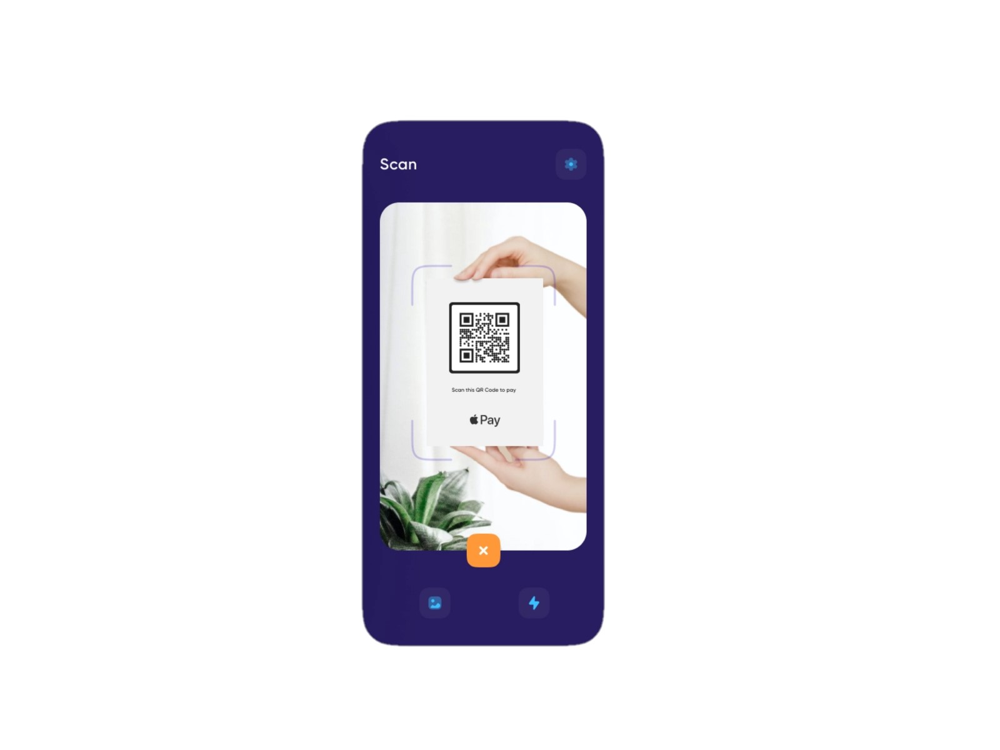

# Queue-R
An android library to help implement a QR scanner interface

Design inspiration and credit goes to ([Maulana Farhan 🐣 | Dribbble](https://dribbble.com/maulanafaa)) .



## Prerequisites

- Request  📸`CAMERA` and 📂`STORAGE` permissions. Read more [Android Permissions](https://developer.android.com/guide/topics/permissions/overview)

## Setup

Add it in your root `build.gradle` at the end of repositories:

```groovy
allprojects {
    repositories {
        //...omitted for brevity
        maven { url 'https://jitpack.io' }
    }
}
```


Add the dependency

```groovy
	dependencies {
	        implementation "com.github.kojofosu:Queue-R:$latest_release"
	}
```


## Usage
Sample implementation [here](app/)
```xml
    <com.mcdev.queuer.ScanView
        android:id="@+id/queuer_view"
        android:layout_width="match_parent"
        android:layout_height="match_parent"
        app:setFlashIconOverlay="true"/>

```

- Initialize your scan view
```kotlin
        private lateinit var scanView: ScanView
        scanView = findViewById<ScanView>(R.id.scan_view)
```

- Create your barcode detector
```kotlin
        val detector: BarcodeDetector = BarcodeDetector.Builder(this)
            .setBarcodeFormats(Barcode.QR_CODE)
            .build()
```

- Create your camera source
```kotlin
        val cameraSource =  CameraSource.Builder(this, detector)
            .setRequestedFps(25f)
            .setAutoFocusEnabled(true)
	    .build()
```

- Then start the scanner. 
	`Note`: Camera permission is required
```kotlin
	scanView.startScan(detector, camerasource)	//TODO camera permission is required.
```


### Licensed under the [MIT License](LICENSE)

```
MIT License

Copyright (c) 2021 Kojo Fosu Bempa Edue

Permission is hereby granted, free of charge, to any person obtaining a copy
of this software and associated documentation files (the "Software"), to deal
in the Software without restriction, including without limitation the rights
to use, copy, modify, merge, publish, distribute, sublicense, and/or sell
copies of the Software, and to permit persons to whom the Software is
furnished to do so, subject to the following conditions:

The above copyright notice and this permission notice shall be included in all
copies or substantial portions of the Software.

THE SOFTWARE IS PROVIDED "AS IS", WITHOUT WARRANTY OF ANY KIND, EXPRESS OR
IMPLIED, INCLUDING BUT NOT LIMITED TO THE WARRANTIES OF MERCHANTABILITY,
FITNESS FOR A PARTICULAR PURPOSE AND NONINFRINGEMENT. IN NO EVENT SHALL THE
AUTHORS OR COPYRIGHT HOLDERS BE LIABLE FOR ANY CLAIM, DAMAGES OR OTHER
LIABILITY, WHETHER IN AN ACTION OF CONTRACT, TORT OR OTHERWISE, ARISING FROM,
OUT OF OR IN CONNECTION WITH THE SOFTWARE OR THE USE OR OTHER DEALINGS IN THE
SOFTWARE.
```
